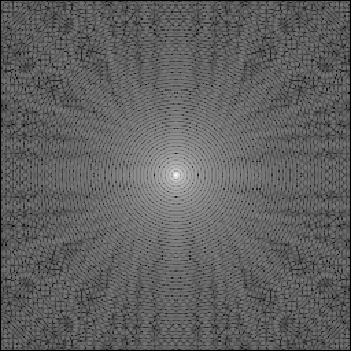

<a name="readme-top"></a>

<!-- PROJECT LOGO -->
<br />
<div align="center">
  <a href="https://github.com/Partha11/image_processing">
    
  </a>

  <h3 align="center">Image Processing</h3>

  <p align="center">
    Low level image processing project using c++
  </p>
</div>

<!-- TABLE OF CONTENTS -->
<details>
  <summary>Table of Contents</summary>
  <ol>
    <li>
      <a href="#about-the-project">Introduction</a>
      <ul>
        <li><a href="#built-with">Built With</a></li>
      </ul>
    </li>
    <li>
      <a href="#getting-started">Getting Started</a>
      <ul>
        <li><a href="#prerequisites">Prerequisites</a></li>
        <li><a href="#installation">Installation</a></li>
      </ul>
    </li>
    <li><a href="#roadmap">Roadmap</a></li>
    <li><a href="#contact">Contact</a></li>
  </ol>
</details>

<!-- ABOUT THE PROJECT -->

## About The Project

[![Product Name Screen Shot][product-screenshot]](files/generated.pgm)

The sole purpose of this project is to test the low level image processing without using any 3rd party libraries. It can read ppm/pgm binary files and produce a 2d array which contains the image pixels. Based on the operation type, it can modify the image pixels that are stored in the array. It is also possible to print the array to a file to visualize the changes that is occuring inside the image.

It focuses on:

-   Displaying the result of an operation on an image using opengl
-   Using the features of OOP (abstraction, inheritance etc.) to efficiently store the image data as an object

Using third party libraries such as `boost`, `opencv` etc. will dramatically improve the performance of the operations that are done here. But it focuses on doing the arithmatic operations without any optimization, to visualize how the data is actually modified.

<p align="right">(<a href="#readme-top">back to top</a>)</p>

### Built With

This section should list any major frameworks/libraries used to bootstrap your project. Leave any add-ons/plugins for the acknowledgements section. Here are a few examples.

-   [![C++ - g++17][CPlusPlus]][CplusPlus-url]
-   [![OpenGL - 3.0][OpenGL]](https://)
-   [![CMake - 3.26][CMake]](https://)

<p align="right">(<a href="#readme-top">back to top</a>)</p>

<!-- GETTING STARTED -->

## Getting Started

This is an example for how to download and install the required libraries to compile and run this project. This has been tested on Debian 11 and Raspberry Pi 3B.

### Prerequisites

This is an example of how to install the compiler in debian based systems. You can install them to any system using the package manager of your choice. Most of the linux based systems uses the g++-14 as default. This code can also run on g++-14, but it is not tested.

-   gnu g++17 compiler<br /><br />
    ```sh
    sudo apt install build-essential gcc-10 g++-10
    ```

### Installation

_Below is an example of how you can instruct your audience on installing and setting up your app. This template doesn't rely on any external dependencies or services._

1. Clone the repository or download the zip from the repository page<br /><br />
    ```sh
    git clone https://github.com/Partha11/image_processing.git
    ```
2. Compile the code for your system<br /><br />
    ```sh
    make all
    ```
3. Run the code<br /><br />
    ```sh
    bin/main
    ```
4. In case you're compiling on a Windows machine, edit the `Makefile` and change the `EXECUTABLE` variable <br /><br />
    ```makefile
    EXECUTABLE  := main.exe
    ```

<p align="right">(<a href="#readme-top">back to top</a>)</p>

<!-- ROADMAP -->

## Roadmap

-   [x] Add compiler flags for opengl
-   [x] Use structured header files for readability
-   [x] Use std::complex instead of calculating I (sqrt(-1))
-   [ ] Add histogram calculation
-   [ ] More image processing algorithms
    -   [ ] Low Pass Filter
    -   [ ] High Pass Filter
    -   [ ] Inverse Fourier Transform
    -   [ ] Fast Fourier Transform

See the [open issues](https://github.com/Partha11/image_processing/issues) for a list of known issues.

<p align="right">(<a href="#readme-top">back to top</a>)</p>

<!-- CONTRIBUTING -->

## Contributing

Contributions are what make the open source community such an amazing place to learn, inspire, and create. Any contributions you make are **greatly appreciated**.

If you have a suggestion that would make this better, please fork the repo and create a pull request. You can also simply open an issue with the tag "enhancement".
Don't forget to give the project a star! Thanks again!

1. Fork the Project
2. Create your Feature Branch (`git checkout -b feature/AmazingFeature`)
3. Commit your Changes (`git commit -m 'Add some AmazingFeature'`)
4. Push to the Branch (`git push origin feature/AmazingFeature`)
5. Open a Pull Request

<p align="right">(<a href="#readme-top">back to top</a>)</p>

<!-- CONTACT -->

## Contact

Name - [Abir Partha](https://www.facebook.com/abir.partha.5/) - abirpartha7@gmail.com<br />
LinkedIn: [Abir Partha](https://www.linkedin.com/in/abir-partha/)

<p align="right">(<a href="#readme-top">back to top</a>)</p>

<!-- MARKDOWN LINKS & IMAGES -->

[product-screenshot]: files/screenshots/logo.png
[CPlusPlus]: https://img.shields.io/badge/C%2B%2B-g%2B%2B17-00599C?style=for-the-badge&logo=cplusplus&logoColor=fff
[CPlusPlus-url]: https://gcc.gnu.org/projects/cxx-status.html#cxx17
[CMake]: https://img.shields.io/badge/CMake-3.26-064F8C?style=for-the-badge&logo=cmake&logoColor=ffffff
[OpenGL]: https://img.shields.io/badge/OpenGL-3.0-5586A4?style=for-the-badge&logo=opengl&logoColor=fff
